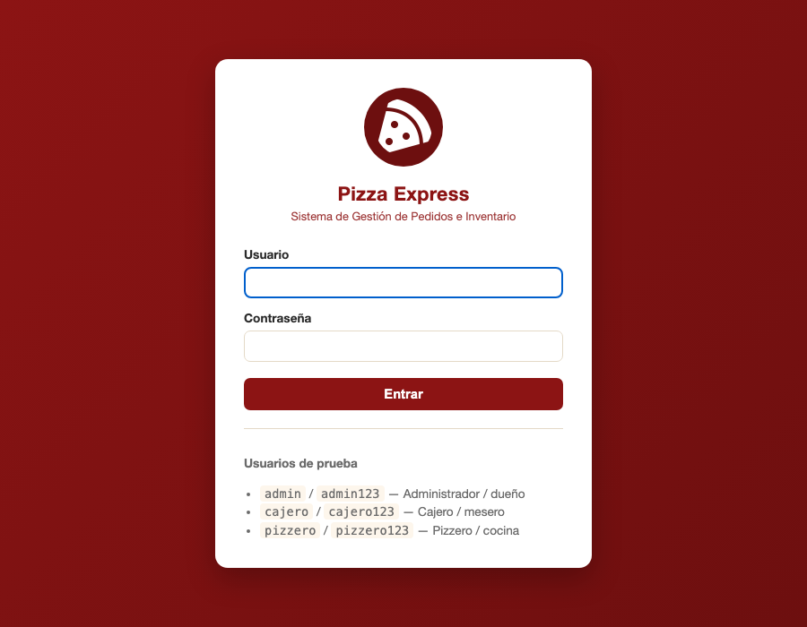
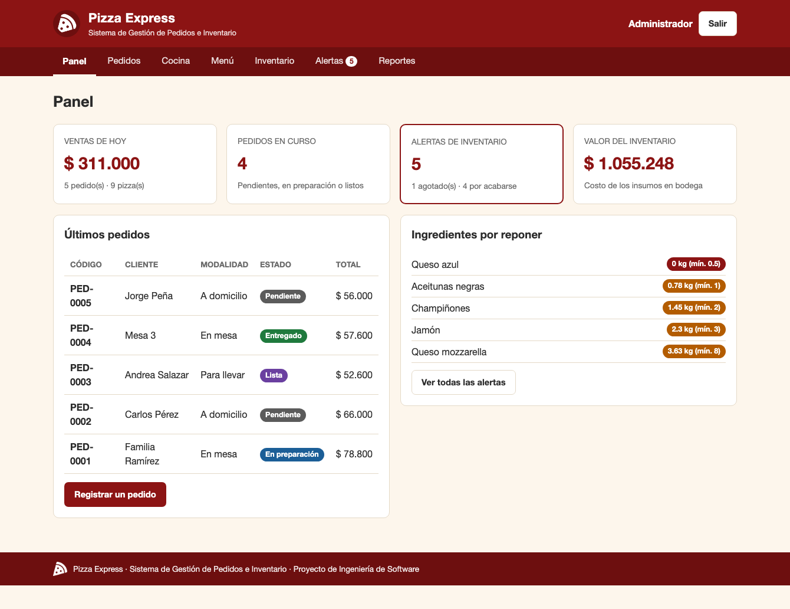
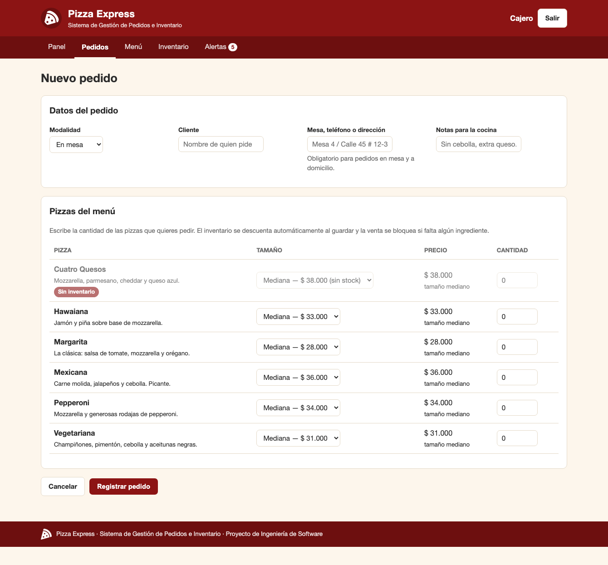
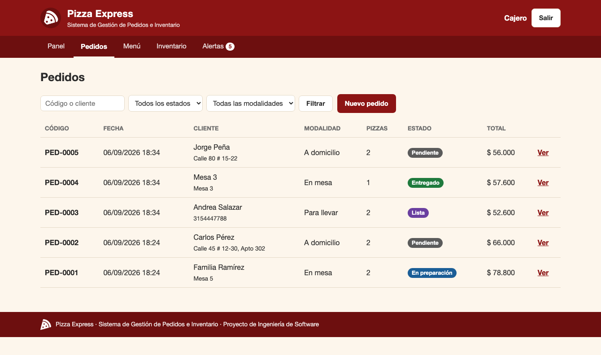
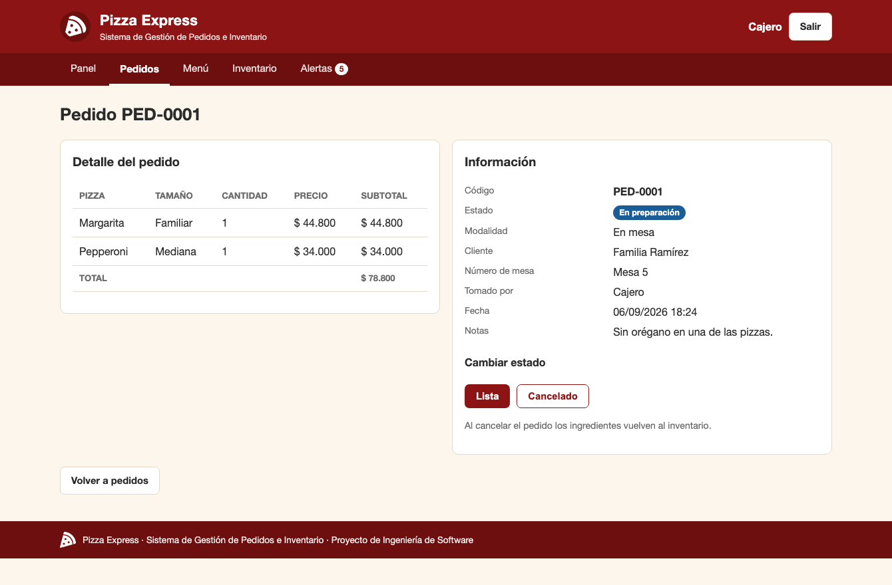
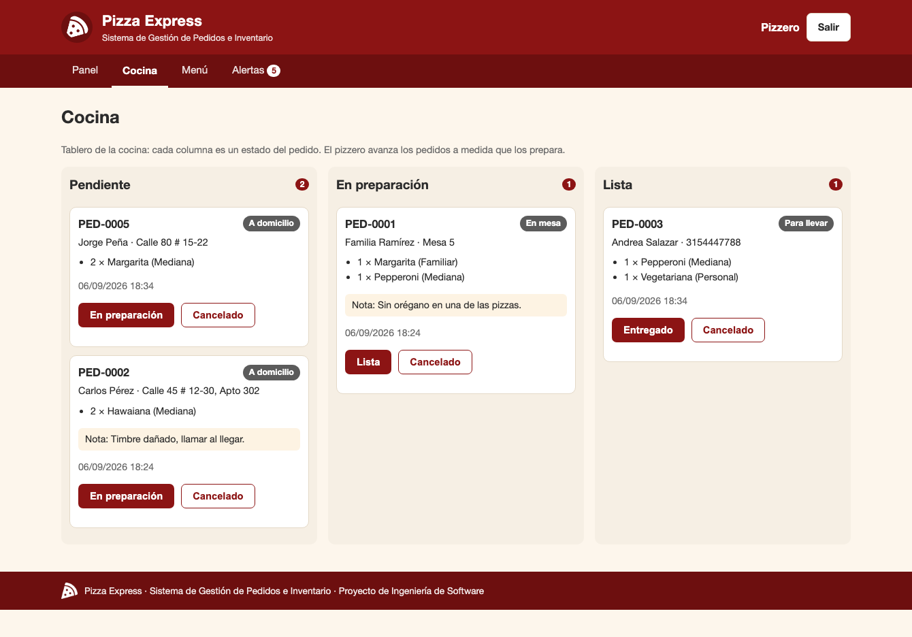
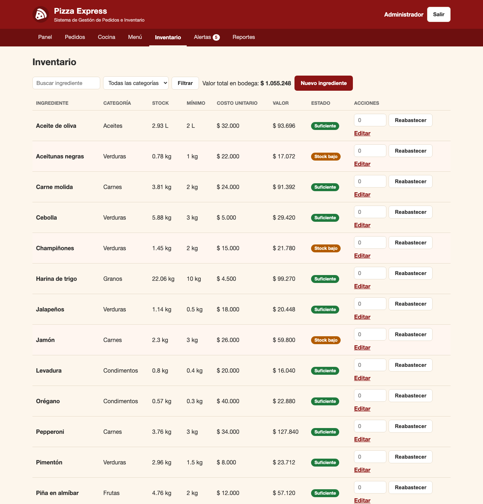
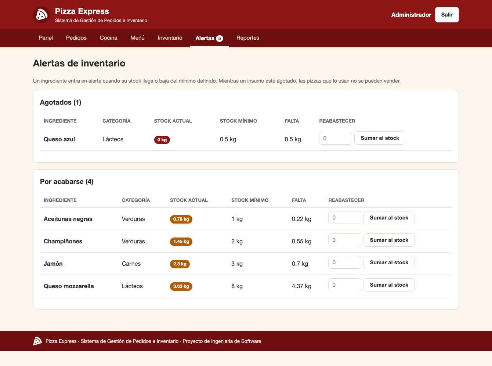
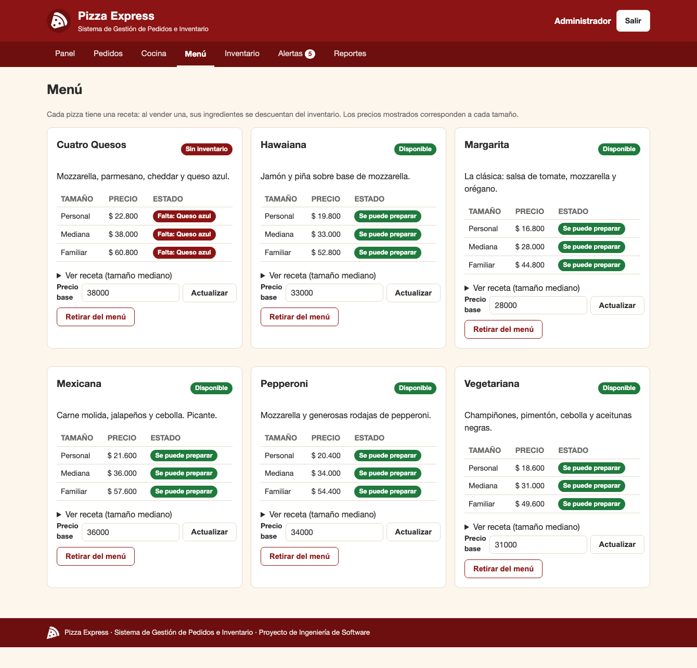
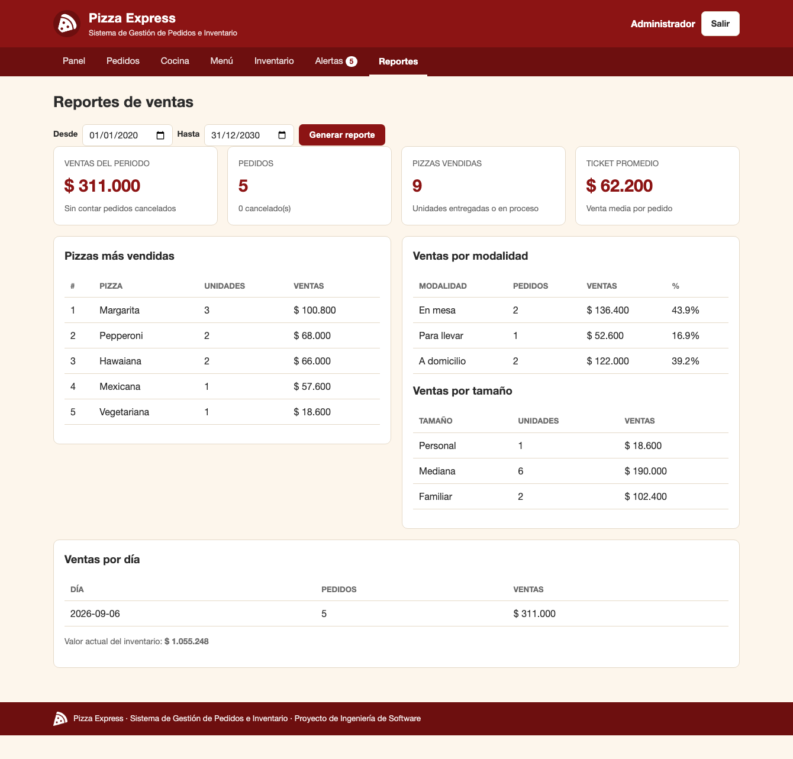

# Manual de usuario

- **Sistema:** Pizza Express — Sistema de Gestión de Pedidos e Inventario
- **Dirigido a:** cajeros, pizzeros y al administrador de la pizzería

---

## 1. ¿Para qué sirve este sistema?

Pizza Express reemplaza la libreta de pedidos y el conteo manual de ingredientes. Con él:

- el **cajero** registra los pedidos de mesa, para llevar y a domicilio;
- el **pizzero** ve en pantalla qué tiene que preparar y en qué orden;
- el **administrador** controla el inventario, los precios y las ventas.

Lo más importante: **cada vez que se vende una pizza, el sistema descuenta solo los ingredientes
que lleva esa pizza**. Así el inventario está siempre al día y el sistema avisa antes de que un
insumo se acabe.

---

## 2. Cómo entrar

Abra el navegador en la dirección que le indique el administrador (por defecto
`http://127.0.0.1:5000`). Verá la pantalla de acceso:

Escriba su usuario y su contraseña y pulse **Entrar**.

### Usuarios del sistema

| Usuario | Contraseña | Quién lo usa | Qué puede hacer |
|---|---|---|---|
| `admin` | `admin123` | Administrador o dueño | Todo: pedidos, cocina, menú, inventario y reportes |
| `cajero` | `cajero123` | Cajero o mesero | Registrar y consultar pedidos, ver menú, inventario y alertas |
| `pizzero` | `pizzero123` | Pizzero o cocina | Tablero de cocina, menú y alertas |

> Si intenta entrar a una sección que no le corresponde, el sistema lo devuelve al panel con el
> mensaje *«Tu rol no tiene permiso para esa sección»*. No es un error: es el control de acceso
> funcionando.

Para salir, pulse **Salir**, arriba a la derecha.

---

## 3. El panel de inicio

Es la primera pantalla al entrar. Resume el día en cuatro indicadores y muestra los últimos
pedidos y los ingredientes que hay que reponer.

| Indicador | Qué significa |
|---|---|
| **Ventas de hoy** | Dinero vendido hoy, sin contar pedidos cancelados |
| **Pedidos en curso** | Pedidos pendientes, en preparación o listos |
| **Alertas de inventario** | Ingredientes agotados o por acabarse. Si hay alguno, el recuadro se resalta |
| **Valor del inventario** | Cuánto dinero hay invertido en los insumos de la bodega |

En la barra de navegación, junto a **Alertas**, aparece un número rojo con la cantidad de
ingredientes que necesitan reposición. Está visible desde cualquier pantalla.

---

## 4. Tareas del cajero

### 4.1 Registrar un pedido

Entre en **Pedidos → Nuevo pedido**.

**Paso 1 — Datos del pedido.**

| Campo | Qué escribir |
|---|---|
| **Modalidad** | *En mesa*, *Para llevar* o *A domicilio* |
| **Cliente** | Nombre de quien pide. Obligatorio |
| **Mesa, teléfono o dirección** | El número de mesa si es *en mesa*, la dirección si es *a domicilio* (en ambos casos es obligatorio) o el teléfono si es *para llevar* (opcional) |
| **Notas para la cocina** | Indicaciones como «sin cebolla» o «extra queso». Las verá el pizzero |

**Paso 2 — Pizzas.** En la tabla del menú, escriba la **cantidad** de cada pizza que quiere pedir
y elija el **tamaño** (personal, mediana o familiar). Las pizzas que no lleve el pedido se dejan
en cero. El precio de cada tamaño aparece en la lista desplegable.

Las pizzas que no se pueden preparar por falta de ingredientes salen atenuadas y con la etiqueta
roja **Sin inventario**.

**Paso 3.** Pulse **Registrar pedido**. El sistema descuenta los ingredientes y le muestra el
detalle del pedido con su código (`PED-0007`, por ejemplo).

### 4.2 Si el sistema no deja guardar el pedido

Aparecerá un recuadro rojo explicando el motivo. Los tres casos habituales:

| Mensaje | Qué pasó | Qué hacer |
|---|---|---|
| *No hay inventario suficiente para este pedido. Falta «Queso azul»: se necesitan 0.08 kg y solo hay 0 kg* | No alcanzan los ingredientes para preparar esas pizzas | Ofrecer otra pizza al cliente, o pedirle al administrador que reabastezca ese ingrediente |
| *Falta el dato «Dirección de entrega» para un pedido a domicilio* | Se dejó vacía la dirección | Escribir la dirección de entrega |
| *Agrega al menos una pizza al pedido* | Todas las cantidades quedaron en cero | Poner la cantidad de al menos una pizza |

> Cuando un pedido se rechaza, **no se descuenta nada** del inventario. Puede corregir el
> formulario y volver a intentarlo con tranquilidad.

### 4.3 Consultar pedidos

En **Pedidos** verá la lista completa, de la más reciente a la más antigua.

Puede filtrar por **código o cliente**, por **estado** y por **modalidad**. Pulse **Ver** para
abrir el detalle de un pedido.

### 4.4 Detalle de un pedido

Muestra las pizzas con su tamaño, cantidad y precio, el total, los datos del cliente, quién tomó
el pedido y las notas. Desde aquí también se puede cambiar el estado del pedido.

---

## 5. Tareas del pizzero

### 5.1 El tablero de cocina

Entre en **Cocina**. Los pedidos aparecen en tres columnas según su estado.

Cada tarjeta muestra el código del pedido, la modalidad, el cliente, las pizzas con su tamaño y
las notas de la cocina.

### 5.2 Avanzar un pedido

Pulse el botón del siguiente estado en la tarjeta:

| Columna | Botón | Cuándo pulsarlo |
|---|---|---|
| Pendiente | **En preparación** | Cuando empiece a armar las pizzas |
| En preparación | **Lista** | Cuando salgan del horno |
| Lista | **Entregado** | Cuando se entregue al cliente o al domiciliario |

El pedido pasa a la columna siguiente y desaparece del tablero cuando se marca como entregado.

### 5.3 Cancelar un pedido

El botón **Cancelado** está disponible mientras el pedido no se haya entregado. Al cancelarlo,
**todos los ingredientes vuelven al inventario automáticamente**.

> Un pedido ya entregado no se puede cancelar: la pizza ya salió y el insumo ya se gastó.

---

## 6. Tareas del administrador

### 6.1 Ver y ajustar el inventario

Entre en **Inventario**.

La tabla muestra, para cada ingrediente, el stock actual, el mínimo, el costo por unidad y el
valor que representa. La columna **Estado** usa tres etiquetas:

| Etiqueta | Significado |
|---|---|
| 🟢 **Suficiente** | Hay más stock que el mínimo |
| 🟠 **Stock bajo** | Se llegó o se bajó del mínimo, pero todavía queda |
| 🔴 **Agotado** | No queda nada; las pizzas que lo usan no se pueden vender |

Puede buscar por nombre y filtrar por categoría.

### 6.2 Reabastecer un ingrediente

Cuando llega mercancía del proveedor, escriba la cantidad recibida en la casilla de la fila
correspondiente y pulse **Reabastecer**. Esa cantidad se **suma** al stock actual.

### 6.3 Crear o editar un ingrediente

Con **Nuevo ingrediente** (o **Editar** en una fila) se abre el formulario. Los campos son:

| Campo | Para qué sirve |
|---|---|
| Nombre | Cómo se llama el insumo |
| Categoría | Para agrupar y filtrar |
| Unidad de medida | kg, L, unidad… |
| Stock actual | Cuánto hay ahora |
| **Stock mínimo** | Cuando el stock llegue a este valor, el sistema lanzará la alerta |
| Costo por unidad | Lo que cuesta comprarlo; sirve para valorar el inventario |

### 6.4 Atender las alertas

La pantalla **Alertas** separa los ingredientes agotados de los que están por acabarse, e indica
cuánto falta para volver al mínimo.

Desde aquí se puede reabastecer directamente con **Sumar al stock**.

### 6.5 Gestionar el menú

En **Menú** aparece cada pizza con su descripción, sus precios por tamaño y si se puede preparar.

- **Ver receta** despliega los ingredientes y las cantidades de la pizza mediana.
- **Precio base** cambia el precio de la pizza mediana; los precios de la personal y la familiar
  se recalculan solos (0,6 y 1,6 veces el precio base).
- **Retirar del menú** la esconde del formulario de pedidos sin borrar su historial. Las pizzas
  retiradas aparecen abajo con la opción **Volver a activar**.

Si una pizza no se puede preparar, el sistema indica exactamente qué ingrediente falta.

### 6.6 Consultar los reportes de ventas

Entre en **Reportes** y elija el rango de fechas.

Encontrará:

- **Resumen del periodo**: dinero vendido, número de pedidos, pizzas vendidas y ticket promedio.
- **Pizzas más vendidas**: ranking por unidades.
- **Ventas por modalidad**: cuánto se vendió en mesa, para llevar y a domicilio, con su porcentaje.
- **Ventas por tamaño**: unidades e importe de cada tamaño.
- **Ventas por día**: detalle diario del periodo.

> Los pedidos cancelados **nunca** cuentan como venta, aunque sí se informa cuántos hubo.

---

## 7. Estados del pedido

| Estado | Color | Significado |
|---|---|---|
| **Pendiente** | Gris | Registrado, la cocina aún no lo empieza |
| **En preparación** | Azul | El pizzero lo está armando |
| **Lista** | Morado | Salió del horno, falta entregarlo |
| **Entregado** | Verde | Cerrado correctamente |
| **Cancelado** | Rojo | Anulado; los ingredientes volvieron al inventario |

El pedido avanza siempre en ese orden: no se puede saltar de *pendiente* a *entregado*.

---

## 8. Preguntas frecuentes

**No puedo vender una pizza y no entiendo por qué.**
Abra **Menú**: junto a cada tamaño aparece si se puede preparar y, si no, qué ingrediente falta.
Avise al administrador para que lo reabastezca.

**Me equivoqué al tomar un pedido.**
Cancélelo desde el detalle del pedido o desde el tablero de cocina. Los ingredientes vuelven al
inventario y puede registrar el pedido correcto.

**¿Por qué una pizza familiar descuenta más ingredientes?**
Porque el tamaño multiplica la receta: la personal consume 0,6 veces la receta, la mediana 1 vez
y la familiar 1,6 veces. El precio sigue la misma proporción.

**Cambié el precio de una pizza. ¿Cambian los pedidos anteriores?**
No. Cada pedido guarda el precio que tenía la pizza en el momento de la venta, así que los
reportes históricos no se alteran.

**El contador rojo de Alertas no baja.**
Solo baja cuando el stock del ingrediente supera su mínimo. Reabastezca una cantidad mayor, o
revise si el stock mínimo definido es demasiado alto para ese insumo.

**Quiero volver a los datos de demostración.**
Pídale al administrador que borre el archivo `datos/pizzaexpress.db` y vuelva a iniciar la
aplicación: se recrea con los datos de ejemplo originales. **Se perderán todos los pedidos
registrados.**
